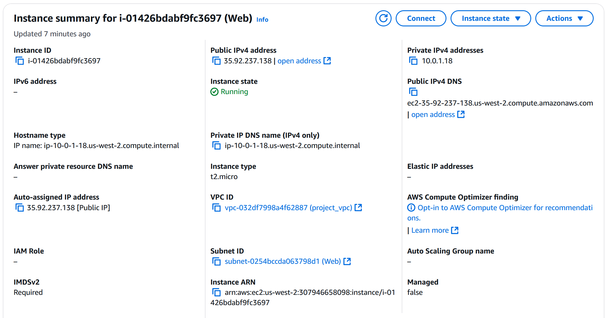

### Members: Keziah Wacnang, Austin Park
---
**To generate ssh key pair:**
* `ssh-keygen -t ed25519 -f ~/.ssh/aws -C "Lab07"`

**Using the `import_lab_key` script for AWS**
* `./import_lab_key ~/.ssh/aws.pub`
* this will import the key to your aws

**To run the included terraform (to create the two EC2 instances)**
* go to the `terraform` directory first
* `terraform init` - to initialize the directory
* `terraform validate` - to check validity of config
* `terraform plan` - to do a dry run
* `terraform apply` - to provision

**Check and Run the `playbook.yml` after completion in the `/ansible` directory**
* `ansible-playbook --syntax-check playbook.yml` - to valide the playbook
* `ansible-playbook playbook.yml` - to run the the playbook

### Screenshots:
---

**Resources:**
* https://docs.ansible.com/ansible/latest/collections/ansible/builtin/package_module.html
* https://docs.ansible.com/ansible/latest/playbook_guide/playbooks_intro.html
* https://docs.ansible.com/ansible/latest/collections/ansible/builtin/file_module.html
* https://docs.ansible.com/ansible/latest/collections/ansible/builtin/copy_module.html
* https://docs.ansible.com/ansible/latest/collections/ansible/builtin/template_module.html
* https://www.middlewareinventory.com/blog/ansible-playbook-example/